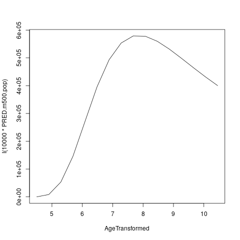

# Lifespan BrainChart Project

This github repository contains the code necessary to replicate the Lifespan BrainChart project:

* bioRxiv pre-print: [https://www.biorxiv.org/content/10.1101/2021.06.08.447489v1](https://www.biorxiv.org/content/10.1101/2021.06.08.447489v1)
* GNU R Shiny App: [http://brainchart.io/](http://brainchart.io/)
* Peer-reviewed publication: PENDING

The repository also contains the objects necessary to reproduce the fitted curves, as see in the in the articles and web-app above.

This repository does not contain any of the datasets. We do not have permission to distributed many of the studies included within the published analyses. However, many are available upon request from the original study groups; see the relevant supplementary material for details of all the studies.

## Lifespan curve estimates (and uncertainty)

Although we cannot share the individual-level data, we are able to share the outcome of the analysis, namely the fitted curves.

The following GNU R objects contain the fitted model and parameter estimates for all curves within the articles:

* [BOOT_GMV.rds](Share/BOOT_GMV.rds)
* [BOOT_sGMV.rds](Share/BOOT_sGMV.rds)
* [BOOT_Ventricles.rds](Share/BOOT_Ventricles.rds)
* [BOOT_WMV.rds](Share/BOOT_WMV.rds)
* [FIT_GMV.rds](Share/FIT_GMV.rds)
* [FIT_sGMV.rds](Share/FIT_sGMV.rds)
* [FIT_Ventricles.rds](Share/FIT_Ventricles.rds)
* [FIT_WMV.rds](Share/FIT_WMV.rds)

The FIT files contain the point estimates, whereas the BOOT files contain the bootstrap replicates used to determine the uncertainty intervals.

An example of how to use these files with the code is shown below.

## Scripts

This repository includes the primary analysis "pipeline" and the simulation study used for validation. It does not include:

* Data import and cleaning scripts for the datasets from each study. There is some work required to standardise the coding of variables across multiple data files from different studies and to merge them into a single dataset.
* Code to exactly recreate the plots in the publications.
* Many of these analyses are "embarrassingly parallel" and should be performed on a computer cluster for parallel efficiency. There are no scripts to interface with scheduling systems, for example SLURM.

First we will illustrate example usage of the code. Then we will document the individual scripts.

### Example usage

#### Obtaining population curves

The following code will load and plot the population median (50th centile) across the lifespan for Grey Matter Volume (GMV).

```r
source("100.common-variables.r")
source("101.common-functions.r")

source("300.variables.r")
source("301.functions.r")

FIT <- readRDS("Share/FIT_GMV.rds")

POP.CURVE.LIST <- list(AgeTransformed=seq(log(90),log(365*95),length.out=2^4),sex=c("Female","Male"))
POP.CURVE.RAW <- do.call( what=expand.grid, args=POP.CURVE.LIST )

CURVE <- Apply.Param(NEWData=POP.CURVE.RAW, FITParam=FIT$param )

plot( PRED.m500.pop ~ AgeTransformed, data=CURVE[CURVE$sex=="Female",],type="l")

plot( I(10000*PRED.m500.pop) ~ AgeTransformed, data=CURVE[CURVE$sex=="Female",],type="l")

```



Note: For numerical stability, we use transformations of covariates, these must be undone to work on the original scales.

### Script documentation

The scripts are divided into five sets:

 1. Common variables and functions
 2. Data setup
 3. Main analyses
 4. Simulation validation
 5. Plotting

Script names have a three-digit prefix indicating their set (first digit) and running order.

Within each set, the x00 and x01 script contain common objects and functions respectively. This helps keep the code separate and clean.

#### 1xx scripts: common

Common functions and a re-write of several gamlss functions (that had issues within our pipeline).

* 100.common-variables.r
* 101.common-functions.r
* 102.gamlss-recode.r

These scripts are sourced in later scripts, they define common variables/objects and functions.

Importantly, they also include a re-write of several gamlss functions to address numerical instability (these may not be necessary in a novel replication, however they are required for using our output fitted objects).

#### 2xx scripts: data setup

Import and clean the data ready for the gamlss fitting. Also, generate simulated dataset (called omega) used for validation.

* 200.variables.r
* 201.functions.r
* 202.functions-plotting.r
* 210.data-setup.r
* 220.simulation-omega-setup.r

#### 3xx scripts: 

These scripts perform the substantial calculations and model fitting.

* 300.variables.r
* 301.functions.r
* 310.fitting.r
* 320.best-fit.r
* 330.bootstrapping.r
* 340.bootstrap-merge.r
* 350.calc-derived.r
* 350.calc-novel.r

Main scripts, these fit the gamlss model(s), select the best (via
BIC), perform bootstrapping, and calculate all necessary derived values.

#### 4xx scripts: 

Additional scripts used for validating the simulation study. Comparing the above output the the known/simulated truth.

#### 5xx scripts: plotting

Some example plotting scripts using GNU R's base graphics. The article uses "nicer" plots generated using ggplot2.

* 500.plotting-variables.r
* 501.plotting-functions.r
* 510.plotting.r

Plotting functions, these *only* use the DERIVED.rds and the NOVEL
fitted objects.
