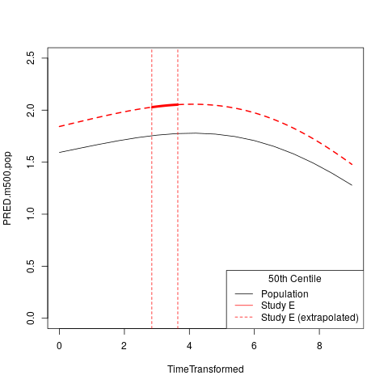
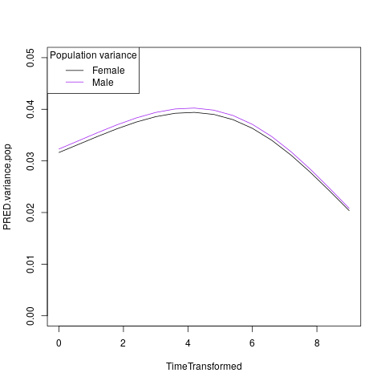
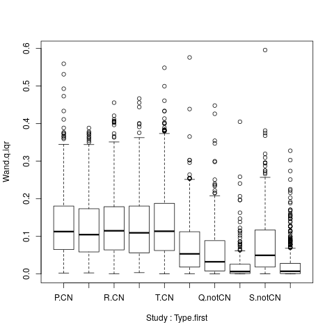

# Lifespan BrainChart Project


  * [Introduction](#introduction)
  * [Datasets](#Datasets)
  * [Lifespan curve estimates (and uncertainty)](#lifespan-curve-estimates--and-uncertainty-)
  * [Scripts](#scripts)
    + [Example usage](#example-usage)
      - [Obtaining population curves](#obtaining-population-curves)
    + [Script documentation](#script-documentation)
      - [1xx scripts: common](#1xx-scripts--common)
      - [2xx scripts: data setup](#2xx-scripts--data-setup)
      - [3xx scripts:](#3xx-scripts-)
      - [5xx scripts: plotting](#5xx-scripts--plotting)
  * [Tutorial](#tutorial)
    + [Fitting a model (310-script) (SI 1.1, SI 1.3)](#fitting-a-model--310-script---si-11--si-13-)
    + [Selecting the best model (320-script) (SI 1.3)](#selecting-the-best-model--320-script---si-13-)
    + [Uncertainty (330-script and 340-script) (SI 1.2)](#uncertainty--330-script-and-340-script---si-12-)
    + [Out-of-sample estimation (350-novel-script) (SI 1.8)](#out-of-sample-estimation--350-novel-script---si-18-)
    + [Derived values (350-derived-script) (SI 1.5, SI 1.7)](#derived-values--350-derived-script---si-15--si-17-)
      - [Normalised Centiles](#normalised-centiles)
      - [Longitudinal Centiles](#longitudinal-centiles)
      - [Population curves](#population-curves)
      - [Example plots](#example-plots)

## Introduction

This github repository contains the code necessary to replicate the Lifespan BrainChart project:

* Paper: [Bethlehem, Seidlitz, White et al. Nature 2022](https://www.nature.com/articles/s41586-022-04554-y)
* GNU R Shiny App: [http://brainchart.io/](http://brainchart.io/)
* Peer-reviewed publication: PENDING

The repository also contains the objects necessary to reproduce the fitted curves, as seen in the article and web-app above.

This repository does not contain any of the datasets. We do not have permission to distributed many of the studies included within the published analyses. However, many are available upon request from the original study groups; see the relevant supplementary material for details of all the studies. Before contacting us with specific queries about the models, data or tool please have a look at our [FAQ](./FAQ.md) page.

## Datasets

Out manuscript lists an extensive description of all datasets currently included in the models, this [linked](https://docs.google.com/spreadsheets/d/15UbnykpXnISXzgEiU9sECyuHXlqirY63V4oTwkuY-58/edit?usp=sharing) form contains a more direct overview of how datasets were accessed (i.e., by direct correspondence or through DUA's) and which datasets were open. Where available we provide hyperlinks to the form or website containing instructions for obtaining data access.

## Lifespan curve estimates (and uncertainty)

Although we cannot share the individual-level data, we are able to share the outcome of the analysis, namely the fitted curves.

The following GNU R objects contain the fitted model and parameter estimates for all curves within the articles:

* [BOOT_GMV.rds](Share/BOOT_GMV.rds)
* [BOOT_sGMV.rds](Share/BOOT_sGMV.rds)
* [BOOT_Ventricles.rds](Share/BOOT_Ventricles.rds)
* [BOOT_WMV.rds](Share/BOOT_WMV.rds)
* [FIT_GMV.rds](Share/FIT_GMV.rds)
* [FIT_sGMV.rds](Share/FIT_sGMV.rds)
* [FIT_Ventricles.rds](Share/FIT_Ventricles.rds)
* [FIT_WMV.rds](Share/FIT_WMV.rds)

The FIT files contain the point estimates, whereas the BOOT files contain the bootstrap replicates used to determine the uncertainty intervals.

An example of how to use these files with the code is shown below.

## Scripts

This repository includes the primary analysis "pipeline" and the simulation study used for validation. It does not include:

* Data import and cleaning scripts for the datasets from each study. There is some work required to standardise the coding of variables across multiple data files from different studies and to merge them into a single dataset.
* Code to exactly recreate the plots in the publications.
* Many of these analyses are "embarrassingly parallel" and should be performed on a computer cluster for parallel efficiency. There are no scripts to interface with scheduling systems, for example SLURM.

First we will illustrate example usage of the code. Then we will document the individual scripts.

### Example usage

#### Obtaining population curves

The following code will load and plot the population median (50th centile) across the lifespan for Grey Matter Volume (GMV).

```r
source("100.common-variables.r")
source("101.common-functions.r")

source("300.variables.r")
source("301.functions.r")

FIT <- readRDS("Share/FIT_GMV.rds")

POP.CURVE.LIST <- list(AgeTransformed=seq(log(90),log(365*95),length.out=2^4),sex=c("Female","Male"))
POP.CURVE.RAW <- do.call( what=expand.grid, args=POP.CURVE.LIST )

CURVE <- Apply.Param(NEWData=POP.CURVE.RAW, FITParam=FIT$param )

plot( PRED.m500.pop ~ AgeTransformed, data=CURVE[CURVE$sex=="Female",],type="l")

plot( I(10000*PRED.m500.pop) ~ AgeTransformed, data=CURVE[CURVE$sex=="Female",],type="l")

```


Note: For numerical stability, we use transformations of covariates, these must be undone to work on the original scales.

### Script documentation

The scripts are divided into five sets:

 1. Common variables and functions
 2. Data setup
 3. Main analyses
 4. Simulation validation
 5. Plotting

Script names have a three-digit prefix indicating their set (first digit) and running order.

Within each set, the x00 and x01 script contain common objects and functions respectively. This helps keep the code separate and clean.

#### 1xx scripts: common

Common functions and a re-write of several gamlss functions (that had issues within our pipeline).

* 100.common-variables.r
* 101.common-functions.r
    * **`Create.Folders()`:** Create folder structure for a specific subset
    * **`Check.Attributes()`:** Utility function for subsets of data
* 102.gamlss-recode.r
    * **`bfpNA()`:** Custom version of `bfp()` that can handle `NA`s
    * **`GGalt()`:** Custom version of `GG()` (GAMLSS family) with robust `GGalt$mean()` and `GGalt$variance()`

These scripts are sourced in later scripts, they define common variables/objects and functions.

Importantly, they also include a re-write of several gamlss functions to address numerical instability (these may not be necessary in a novel replication, however they are required for using our output fitted objects).


#### 2xx scripts: data setup

Import and clean the data ready for the gamlss fitting. Also, generate simulated dataset (called omega) used for validation.

* 200.variables.r
* 201.functions.r
    * None
* 211.data-setup.r
    * Custom script to load and clean the raw data, outputs are `SUBSET.rds` and model objects
* 220.simulation-omega-setup.r
    * Custom script to create simulated data, outputs are `SUBSET.rds` and model objects

Each data script is a custom

#### 3xx scripts: 

These scripts perform the substantial calculations and model fitting.

* 300.variables.r
* 301.functions.r
    * **`Fit.Function()`:** Calls `Extract.Wrapper()`
        * **`gamlssWrapper()`:** Simple wrapper around `gamlss()` to ensure consistent calls
        * **`Extract.Summary()`:** Generate consistent summary of subset/dataset
        * **`Extract.Param()`:** Create custom `ParamObj` (new class of object) from `gamlss()` output
        * **`Extract.Wrapper()`:** Combined call of `gamlssWrapper()`, `Extract.Summary()` and `Extract.Param()`
        * **`Save.Extracted()`:** Save `gamlss()` output objects, called from within `Fit.Function()`
    * **`Make.bfpNA.model.from.extract()`:** Convert `fp()` into `bfpNA()`, i.e. define fractional polynomial explicitly
    * **`Find.Models.To.Fit()`:** Find candidate models under MODEL folder
    * **`Make.Longitudinal()`:** For longitudinal follow-up, generate subject-specific summary measures, e.g. IQR
    * **`Boot.Function()`:** Generate a bootstrap replicate dataset and call `Extract.Wrapper()`
    * **`ValidateCleanInput()`:** Check dataset conforms to `ParamObj`
    * **`Apply.Param()`:** Use `ParamObj` to generate predictions for a dataset (calls `ValidateCleanInput()`)
    * **`Apply.FitAndBoot()`:** Calls `Apply.Param()` on all bootstrap replicate `ParamObj`s
    * **`Load.Subset.Wrapper()`:** Load multiple elements into `HOLDER` object
    * **`Calc.Expanded()`:** Wrapper calling `Ranef.MLE.Func()` and `Add.New.Ranefs()` 
        * **`Find.Fitted.Levels()`:** Compare `ParamObj` with dataset to find studies with fitted random-effects
        * **`Find.Missing.Levels()`:** Compare `ParamObj` with dataset to find studies with missing/unknown random-effects
        * **`Ranef.MLE.Func()`:** Estimate random-effects using maximum likelihood (using dXX from GAMLSS family)
        * **`Add.New.Ranefs()`:** Expand a `ParamObj` with new study random-effects
* 310.fitting.r
    * Uses `Fit.Function()`
* 320.best-fit.r
    * Extracts BIC values from fitted models and selects the best (makes a copy or symlink as `MODEL.rds`)
* 330.bootstrapping.r
    * Uses `Boot.Function()`
* 340.bootstrap-merge.r
    * Merges separate bootstrap outputs into `BOOT.EXTRACT.rds`
* 350.calc-derived.r
    * Uses `Apply.Param()` and `Apply.FitandBoot()` to create all derived curves and outputs (for lifespan and study-specific curves) saved as `DERIVED.rds`
* 350.calc-novel.r
    * Uses `Calc.Expanded()` to estimate random-effects for novel data saved as `FIT.EXPANDED.rds` (for fit and bootstrap replicates)

Main scripts, these fit the gamlss model(s), select the best (via
BIC), perform bootstrapping, and calculate all necessary derived values.


#### 5xx scripts: plotting

Some example plotting scripts using GNU R's base graphics. The article uses "nicer" plots generated using ggplot2 (not included in this repository).

* 500.plotting-variables.r
* 501.plotting-functions.r
    * None
* 510.plotting.r
    * Example plots using `DERIVED.rds` object

Plotting functions, these *only* use the `DERIVED.rds` and the fitted objects from novel data (`FIT.EXPANDED.rds`).


## Tutorial

This tutorial uses simulated data (as illustrated in the paper). This is generated using script `220.simulation-omega.setup.r`. Either manually execute this script, or invoke R on the command line to execute the script. For example,:

```r
Rscript 220.simulation-omega-setup.r
```

For the following tutorial, the required functions and variables can be loaded by sourcing the following scripts:
```r
source("100.common-variables.r")
source("101.common-functions.r")

source("300.variables.r")
source("301.functions.r")
```

(Note: none of the above are specific to the simulated data)


### Fitting a model (310-script) (SI 1.1, SI 1.3)

First we load a dataset, in this tutorial we will use the Wand phenotype. Using a call to the `Extract.Wrapper()` function we can fit a model to the data. 

We will fit a single model, `base200.GGalt.fp.rds`, using a Generalised Gamma outcome distribution (GG) including a second-order fractional polynomial of age in the mu-component, whereas the sigma-component and nu-components do not depend on age. This model specification uses the gamlss-pacakge in-built `fp()` function to determine the best-fitting fractional polynomial (of the specified order).


```r
## 310-script
PATHS <- Create.Folders( "omega-Wand__.n0000" )
HOLDER <- Load.Subset.Wrapper( Tag="omega-Wand__.n0000", LSubset=TRUE )
HOLDER$MODEL <- readRDS( file.path( PATHS$MODEL, "base200.GGalt.fp.rds" ) )
EXTRACT <- Extract.Wrapper( HOLDER, Store.Full=TRUE ) ## store full fitting object to use as initial point of bfpNA() re-fit [expect 12 iterations]
summary(EXTRACT$FIT.FULL) ## standard summary of a GAMLSS fit
getSmo(EXTRACT$FIT.FULL,what="mu")
getSmo(EXTRACT$FIT.FULL,what="mu")$power
```

After the fitting in completed (in 12 iterations) we may inspect the fitted model using the usual `summary()` function. Further, since the fractional polynomial is included as a smoothing term, we may access the fitted smoother using `getSmo()` and find that the optimal second-order fractional polynomial has powers of 1 and 3 (i.e. a linear and cubic age-related term).

In order to properly compare models (since the `fp()` smoother term includes an intercept which complicates the interpretation of the main intercept, and to avoid any re-fitting of the fractional polynomial smoother, we translate the model from using the `fp()` smoother to a fixed transformation using `bfp()`. This requires re-fitting the revised model as follows:

```r
HOLDER$MODEL <- Make.bfpNA.model.from.extract( EXTRACT$param )
saveRDS( HOLDER$MODEL, file.path( PATHS$MODEL, "base200.GGalt.bfpNA.rds" ) )
EXTRACT.bfp <- Extract.Wrapper( HOLDER, Fit.Full=FALSE, start.from=EXTRACT$FIT ) ## helpful to start.from, improves convergence speed [expect 5 iterations]
Save.Extracted( EXTRACT.bfp, PATHS, "base200.GGalt.bfpNA.rds", Save.Full=FALSE )
```
Note: we start the iterative model fitting at a better initial point, meaning the convergence occurs faster. We will do this for bootstrap replicates as well to reduce computation.

### Selecting the best model (320-script) (SI 1.3)

Using the fractional polynomial approach within with multiple components (mu, sigma, nu, tau) of the gamlss distribution families, leads to the question of the best model.

We can readily extract the BIC for a given model, then compare across models. In this tutorial we have only fitted one model, but there are many possible models within the `RDS/omega-Wand__.n0000/MODEL/` folder (different outcome distributions and component specifications).

```r
## 310-script
EXTRACT.bfp$param$BIC ## compare BIC on all fitted models

file.copy(from=file.path(PATHS$FIT.EXTRACT,"base200.GGalt.bfpNA.rds"),to=file.path(PATHS$PATH,"MODEL.rds"))
file.copy(from=file.path(PATHS$FIT.EXTRACT,"base200.GGalt.bfpNA.rds"),to=file.path(PATHS$PATH,"FIT.EXTRACT.rds"))
## or
file.symlink(from=file.path("MODEL","base200.GGalt.bfpNA.rds"),to=file.path(PATHS$PATH,"MODEL.rds"))
file.symlink(from=file.path("FIT.EXTRACT","base200.GGalt.bfpNA.rds"),to=file.path(PATHS$PATH,"FIT.EXTRACT.rds"))
```

Our later scripts assume a single best model is selected, the last lines of code above copy (or create a link if on a system that allows such things).

### Uncertainty (330-script and 340-script) (SI 1.2)

We use the non-parametric bootstrap to determine uncertainty of our estimates. The `Boot.Function()` function takes a so-called Holder-object (data, model, fit), generates a stratified resample replicate, and refits the model.

The replicates are stratified by study and sex, to ensure balance across these two key factors. The existing fit is used to generate better initialisations (to reduce computing time/number of iterations).

Note: This step is "embarresingly parallel" and should be performed using more appropriate parallel computing on high performance computing (HPC) resources (code not shown).


```r
## 330-script (and 340-script)
HOLDER <- Load.Subset.Wrapper( Tag="omega-Wand__.n0000", LSubset=TRUE, LModel=TRUE, LFit=TRUE )

BOOT <- list()
BOOT[[1]] <- Boot.Function(n=1,Base.Seed=12345,Holder=HOLDER)
BOOT[[2]] <- Boot.Function(n=2,Base.Seed=12345,Holder=HOLDER)
BOOT[[3]] <- Boot.Function(n=3,Base.Seed=12345,Holder=HOLDER)
for( NUM in 4:100 ) { ## 100s of bootstrap replicates required
    BOOT[[NUM]] <- Boot.Function(n=NUM,Base.Seed=12345,Holder=HOLDER)
}

Reduce(rbind,lapply(BOOT,function(X){X$param$mu$fixef}))
Reduce(rbind,lapply(BOOT,function(X){X$param$sigma$fixef}))

apply( Reduce(rbind,lapply(BOOT,function(X){X$param$mu$fixef})), 2, quantile, probs=c(0.05,0.95), na.rm=TRUE )
apply( Reduce(rbind,lapply(BOOT,function(X){X$param$sigma$fixef})), 2, quantile, probs=c(0.05,0.95), na.rm=TRUE )
apply( Reduce(rbind,lapply(BOOT,function(X){X$param$nu$fixef})), 2, quantile, probs=c(0.05,0.95), na.rm=TRUE )

saveRDS(object=BOOT,file=file.path(PATHS$PATH,"BOOT.EXTRACT.rds"))
```

With an appropriate number of bootstrap replicates we can generate bootstrap confidence intervals for the lifespan curves.

### Out-of-sample estimation (350-novel-script) (SI 1.8)

We will now estimate (random-effects) parameters for out-of-sample (i.e. novel) data. In our simulated example there are two additional studies, U and V, which were excluded from the initial fitting. This can be seen in the tabulation below.


```r
## 350-novel-script
PRIMARY <- Load.Subset.Wrapper( Tag="omega-Wand__.n0000", LSubset=TRUE, LModel=TRUE, LFit=TRUE, LBoot=TRUE, LData=TRUE )

dim(PRIMARY$DATA)   ## Note: PRIMARY$DATA and PRIMARY$SUBSET are different,
dim(PRIMARY$SUBSET) ##       the latter contains only observations used for fitting the model
table(PRIMARY$SUBSET$Study) ## Studies U and V were not included in the orginal set

NOVEL <- list()
NOVEL$DATA <- dim(readRDS(file=file.path(PATHS$NOVEL,"Wandu_.n0200.rds"))) 
## or                                                                                                                                                                        
NOVEL$DATA <- PRIMARY$DATA[ with(PRIMARY$DATA, which(Study=="U" & INDEX.OB==1 & INDEX.TYPE=="CN") ), ]
```

Study U can be obtained manually (but subsetting the data), or as part of the script generating the simulated example the additional studies were saved in the `NOVEL` folder.

The following code block does the following:

* Apply the current fit-object to the novel data (which will result in NAs for the missing study random-effects) using `Apply.Param()`.
* `Apply.Param()` returns a `missing.levels` attribute with details of the random-effects that need to be estimated.
* `Calc.Expanded()` uses the `missing.levels` object and existing fit to estimate the missing random-effects for the novel data.
* Finally, this expanded fit-object is saved.


```r
NOVEL$DATA.PRED <- Apply.Param(NEWData=NOVEL$DATA,
                               FITParam=PRIMARY$FIT.EXTRACT$param,
                               Reference.Holder=PRIMARY,
                               Pred.Set=NULL, Prefix="", Add.Moments=FALSE, Add.Normalise=FALSE, Add.Derivative=FALSE, MissingToZero=TRUE,
                               verbose=FALSE )
PRIMARY$MODEL ## in our selected model only mu has a random-effect
summary(NOVEL$DATA.PRED) ## see that mu.wre is NA, but sigma.wre and nu.wre are not (as there are no missing random-effects)

attr(NOVEL$DATA.PRED,"missing.levels") ## Apply.Param() returns information on missing random-effects

NOVEL$SUBSET <- NOVEL$DATA.PRED[attr(NOVEL$DATA.PRED,"logical.selectors")$REFIT.VALID,]
EXPANDED <- Calc.Expanded(NewData=NOVEL$SUBSET,
                          Cur.Param=PRIMARY$FIT.EXTRACT$param,
                          Missing=attr(NOVEL$DATA.PRED,"missing.levels") )

tail(data.frame(EXPANDED$mu$ranef,EXPANDED$mu$ranef.TYPE)) ## U-specific random-effects added

EXPANDED.PATH <- file.path( PATHS$NOVEL, "U" )

if( !dir.exists(EXPANDED.PATH) ) {
    dir.create(EXPANDED.PATH)
}

saveRDS(object=list(param=EXPANDED,summary=NULL),
        file=file.path(EXPANDED.PATH,"FIT.EXPANDED.rds"))
```

Note: The above process must be repeated for all the bootstrap replicates in order to understand the uncertainty of the out-of-sample estimates.

### Derived values (350-derived-script) (SI 1.5, SI 1.7)


There are three types of derived values calculated in this script:

* Population curves 
* Longitudinal centiles (SI 1.7)
* Normalised centiles (SI 1.5)


#### Normalised Centiles

Using the `Apply.Param()` function with the `Add.Normalise` argument we apply a fit object to a dataset and obtain the centiles (`Wand.q.wre`) and normalised values (`Wand.normalised`); as well as individual-level predicted values which can be compared to the observed value.

```r
## 350-derived-script
PRIMARY <- Load.Subset.Wrapper( Tag="omega-Wand__.n0000", LSubset=TRUE, LModel=TRUE, LFit=TRUE, LBoot=TRUE, LData=TRUE )

PRIMARY$DATA.PRED <- Apply.Param(NEWData=PRIMARY$DATA, Reference.Holder=PRIMARY, FITParam=PRIMARY$FIT.EXTRACT$param,
                                 Pred.Set=c("l025"=0.025,"l250"=0.250,"m500"=0.5,"u750"=0.750,"u975"=0.975),
                                 Add.Moments=FALSE, Add.Normalise=TRUE, Add.Derivative=FALSE,
                                 MissingToZero=TRUE, NAToZero=TRUE )
```

#### Longitudinal Centiles

The `Make.Longitudinal()` function determines all individuals with longitudinal follow-up, and using the output from the call to `Apply.Param()` above calculates longitudinal summaries (i.e. the IQR of centiles).


```r
PRIMARY$LONG.SUMMARY <- Make.Longitudinal( Holder=PRIMARY )
```

#### Population curves

To generate predicted population curves we first generate a new data frame containing the appropriate covariates.

In the following code block we generate two data frames, one without study and one with the study set to "E". The former will, in the absence of a specified study, return the population level predictions. Whereas the latter will return study-specific predictions.


```r
range(PRIMARY$DATA[,"TimeTransformed"]) ## whole dataset
range(PRIMARY$DATA[PRIMARY$DATA$Study=="E","TimeTransformed"]) ## only study E

PRIMARY$CURVE <- Apply.Param(NEWData=expand.grid(list(
                                 TimeTransformed=seq(0,9,length.out=2^4),
                                 Grp=c("Female","Male")
                             )),
                             FITParam=PRIMARY$FIT.EXTRACT$param )


PRIMARY$CURVE.E <- Apply.Param(NEWData=expand.grid(list(
                                 TimeTransformed=seq(0,9,length.out=2^8),
                                 Grp=c("Female","Male"),
                                 Study="E"
                             )),
                             FITParam=PRIMARY$FIT.EXTRACT$param )
```

#### Example plots

Using the derived values we can generate plots as in the paper (code not included). The following replicate some aspects of the figures from the paper using the simulated data.


```r
RANGE <- range(PRIMARY$DATA[PRIMARY$DATA$Study=="E","TimeTransformed"])
plot( PRED.m500.pop ~ TimeTransformed, data=subset(PRIMARY$CURVE,Grp=="Female"), type="l", ylim=c(0,2.5) )
lines( PRED.m500.wre ~ TimeTransformed, data=subset(PRIMARY$CURVE.E,Grp=="Female"&TimeTransformed<RANGE[1]), col="red", lwd=2, lty=2 )
lines( PRED.m500.wre ~ TimeTransformed, data=subset(PRIMARY$CURVE.E,Grp=="Female"&TimeTransformed>RANGE[2]), col="red", lwd=2, lty=2 )
lines( PRED.m500.wre ~ TimeTransformed, data=subset(PRIMARY$CURVE.E,Grp=="Female"&TimeTransformed<RANGE[2]&TimeTransformed>RANGE[1]), col="red", lwd=4, lty=1 )
abline(v=RANGE,col="red",lty=2)
legend("topleft",c("Population","Study E","Study E (extrapolated)"),lty=c(1,1,2),col=c("black","red","red"),title="50th Centile")

plot( PRED.variance.pop ~ TimeTransformed, data=subset(PRIMARY$CURVE,Grp=="Female"), type="l", ylim=c(0,0.05) )
lines( PRED.variance.pop ~ TimeTransformed, data=subset(PRIMARY$CURVE,Grp=="Male"), col="purple" )
legend("bottomright",c("Female","Male"),lty=1,col=c("black","purple"),title="Population variance")


names(PRIMARY$LONG.SUMMARY)
tail(PRIMARY$DATA.PRED[ PRIMARY$DATA.PRED$Study=="V", ])

BP <- boxplot( Wand.q.iqr ~ Study + Type.first, data=droplevels(na.omit(PRIMARY$LONG.SUMMARY[,c("Wand.q.iqr","Study","Type.first")])) )
```

Illustrating 50th centile population curve and 50th centile Study E specific curve (note, this is equivalent to the example output using the GMV fit object):



Illustrating the population variance (for females and males) curves:



Illustrating the longitudinal IQR for CN and non-CN across studies with follow-up:



